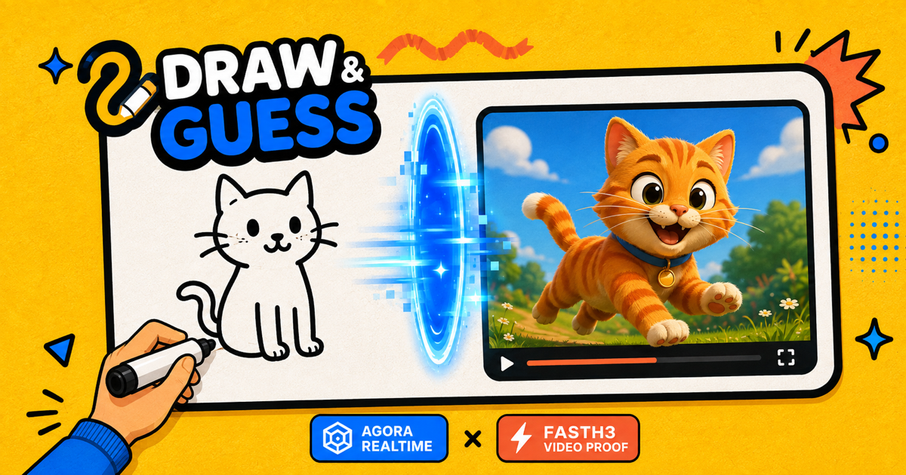
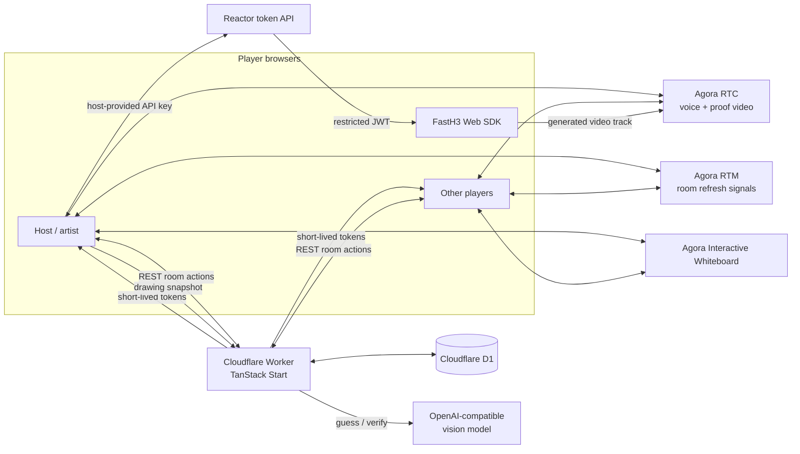

<div align="center">


# Draw & Guess

**Draw it. Guess it. Beat FastH3.**

A realtime multiplayer drawing game where the AI challenger only wins after it
guesses the sketch and generates matching video proof.

[](./LICENSE)


**English** · [简体中文](./README.zh-CN.md)

[Play the live demo](https://drawguess.app)

</div>

---

Draw & Guess is a browser party game for friends and one optional AI player.
Players share a synchronized canvas, talk over realtime voice, rotate artists,
race to identify the secret word, and watch FastH3 attempt the same challenge.

FastH3 has a stricter win condition than a human: a correct text guess is only
the first step. It must also generate a short video that depicts the answer, and
an independent vision pass must verify that proof before the AI receives the win.



## Architecture



Runtime responsibilities:

- **Cloudflare Worker:** owns room state, validates actions, signs Agora tokens,
  provisions Whiteboard rooms, calls the vision provider, and rate-limits public
  endpoints.
- **Cloudflare D1:** stores rooms, seats, rounds, guesses, scores, AI attempts,
  and short-lived rate-limit records.
- **Agora RTC:** carries optional microphone audio and relays the FastH3 proof
  video to every player.
- **Agora RTM:** sends low-latency refresh and presence signals while D1 remains
  the authoritative game state.
- **Agora Interactive Whiteboard:** synchronizes drawing strokes, tools, undo,
  clearing, and per-player write permissions.
- **OpenAI-compatible vision:** guesses from drawing snapshots and verifies three
  frames sampled from the generated proof video.
- **FastH3:** runs in the host browser with a host-provided Reactor API key. The
  key goes directly to Reactor and never passes through this app's Worker.

See [docs/architecture.md](./docs/architecture.md) for the lifecycle, trust
boundaries, and fallback behavior.

## Features

- Shareable six-character rooms with recoverable, tab-scoped seats.
- Host controls for rounds, draw time, player readiness, and the AI seat.
- Rotating artists, three-word choice, countdowns, progressive hints, scoring,
  replay, and host transfer when someone leaves.
- Synchronized Agora Whiteboard with pencil, shapes, eraser, brush sizes, color
  palette, undo, clear, and keyboard shortcuts.
- Optional Agora RTC voice with explicit join/leave controls and token renewal.
- FastH3 drawing guesses, proof-video generation, frame verification, and live
  proof-video relay to the room.
- Empty-canvas protection so the AI does not guess before anyone draws.
- OpenAI Responses API plus OpenAI-compatible chat-completions providers.
- Optional PostHog product analytics.
- Cloudflare Workers, D1, rate limiting, secure response headers, canonical URLs,
  sitemap, robots directives, Open Graph metadata, and structured data.

## Quick Start

### Requirements

- Node.js 22 or newer
- pnpm 11
- A Cloudflare account with Workers and D1
- An Agora project with App Certificate enabled
- Agora Interactive Whiteboard credentials
- An OpenAI API key, or a compatible vision API
- A Reactor API key only when you want to test the FastH3 challenger

### 1. Install

```bash
git clone https://github.com/zicojiao/soundoff.git draw-and-guess
cd draw-and-guess
pnpm install
cp .env.example .env.local
cp .dev.vars.example .dev.vars
cp wrangler.example.jsonc wrangler.jsonc
```

Real credentials belong in `.dev.vars` or Worker secrets. The repository ignores
all local env files and `wrangler.jsonc`.

### 2. Configure the browser build

Fill `.env.local`:

```bash
VITE_PUBLIC_SITE_URL=http://localhost:3000
VITE_DEPLOYMENT_ALIAS_HOST=

# Optional analytics. PostHog project tokens are public browser identifiers.
VITE_POSTHOG_PROJECT_TOKEN=
VITE_POSTHOG_HOST=https://us.i.posthog.com
```

`VITE_PUBLIC_SITE_URL` drives canonical metadata and production redirects. Set
it to your own HTTPS origin when deploying a fork.

### 3. Configure server credentials

Fill `.dev.vars`:

```bash
AGORA_APP_ID=
AGORA_APP_CERTIFICATE=

AGORA_WHITEBOARD_APP_IDENTIFIER=
AGORA_WHITEBOARD_ACCESS_KEY=
AGORA_WHITEBOARD_SECRET_KEY=
AGORA_WHITEBOARD_REGION=us-sv

OPENAI_API_KEY=
AI_API_BASE_URL=https://api.openai.com/v1
OPENAI_VISION_MODEL=gpt-5.4-mini
```

For development, `AGORA_WHITEBOARD_SDK_TOKEN` can be used instead of Whiteboard
AK/SK. Production should use AK/SK so the Worker can create short-lived,
room-scoped reader and writer tokens.

Never prefix server secrets with `VITE_`; Vite exposes every `VITE_` variable to
the browser bundle.

### 4. Create the local database

The example Wrangler config uses a dummy D1 ID that is sufficient for local
development:

```bash
pnpm db:migrate:local
```

The single migration creates only the tables used by Draw & Guess.

### 5. Run

```bash
pnpm dev
```

Open [http://localhost:3000](http://localhost:3000). Create a room in one browser
tab and open its invitation URL in another tab or device.

## Agora Setup

### RTC and RTM

1. Create an Agora project and enable App Certificate authentication.
2. Put the App ID and App Certificate in `.dev.vars`.
3. Keep the certificate server-only. The Worker signs one-hour tokens; browsers
   receive only their room channel, UID, and short-lived token.

The client registers RTC and RTM event handlers before joining, renews both
tokens together, and stops/closes local media tracks before leaving.

### Interactive Whiteboard

1. Enable Interactive Whiteboard for the Agora project.
2. Copy the Whiteboard App Identifier, Access Key, and Secret Key.
3. Set the matching variables in `.dev.vars`.
4. Use the region configured for that Whiteboard project, such as `us-sv`.

The Worker creates one Whiteboard room per game room and issues a writer token
only to the active artist. Everyone else receives a reader token.

## FastH3 and AI Proof

FastH3 is optional. The room host clicks **Invite FastH3**, enters a Reactor API
key, and the browser exchanges it directly with Reactor for a 15-minute JWT
restricted to one `reactor/fast-h3` session.

During a drawing round:

1. The active artist's browser samples the shared Whiteboard only after visible
   strokes exist.
2. The Worker asks the configured vision model for a concrete guess.
3. A correct guess starts a five-second FastH3 proof clip in the host browser.
4. The browser publishes the generated video track through Agora RTC so all
   players can see it.
5. Three sampled frames return to the Worker for independent visual verification.
6. FastH3 wins only when that verification passes.

The Reactor API key is stored in the host's browser storage for convenience.
Use a limited key, clear site storage on shared devices, and never commit the key.

## Deploy to Cloudflare Workers

Create a D1 database:

```bash
pnpm exec wrangler d1 create draw-and-guess-db
```

Copy the returned database ID into your local `wrangler.jsonc`, then apply the
schema:

```bash
pnpm db:migrate:remote
```

Set server secrets:

```bash
pnpm exec wrangler secret put AGORA_APP_CERTIFICATE
pnpm exec wrangler secret put AGORA_WHITEBOARD_ACCESS_KEY
pnpm exec wrangler secret put AGORA_WHITEBOARD_SECRET_KEY
pnpm exec wrangler secret put OPENAI_API_KEY
```

Put public project identifiers and provider defaults in the `vars` block of your
local `wrangler.jsonc`. Add custom-domain routes there only if you own them.

For production metadata, set these build-time variables in `.env.production` or
your CI environment:

```bash
VITE_PUBLIC_SITE_URL=https://your-domain.example
VITE_DEPLOYMENT_ALIAS_HOST=your-worker.your-subdomain.workers.dev
```

Deploy:

```bash
pnpm deploy
```

## Commands

| Command | Purpose |
| --- | --- |
| `pnpm dev` | Start the local Worker and Vite dev server |
| `pnpm test` | Run the Vitest suite once |
| `pnpm test:watch` | Run tests in watch mode |
| `pnpm typecheck` | Type-check without emitting files |
| `pnpm build` | Build browser and Worker bundles |
| `pnpm generate-routes` | Regenerate the TanStack route tree |
| `pnpm db:migrate:local` | Apply D1 migrations locally |
| `pnpm db:migrate:remote` | Apply D1 migrations to the configured remote DB |
| `pnpm deploy` | Build and deploy with Wrangler |

## Project Structure

```text
src/
  components/       Home, room, whiteboard, dialogs, FastH3 proof UI
  lib/agora/        RTC + RTM browser session and media cleanup
  lib/game/         Game model, lifecycle, audio cues, whiteboard helpers
  lib/server/       Authoritative game state, tokens, vision, rate limiting
  lib/seo/          Canonical-origin handling
  routes/           Pages and room API endpoints
migrations/         Fresh D1 schema
public/             Icons, social image, hero art, manifest, SEO files
scripts/            FastH3 browser-WASM asset synchronization
docs/               Architecture and trust-boundary documentation
```

## Security

- Seat tokens are random, stored per tab, and hashed before D1 storage.
- Agora App Certificate, Whiteboard secret, and vision API key stay server-side.
- Agora and Whiteboard credentials issued to clients are short-lived and scoped.
- Room APIs validate seat ownership and use D1 primary sessions for
  read-after-write consistency.
- Public create-room requests are rate-limited by coarse network identity.
- Drawing and proof images are restricted to bounded data-image formats.
- Host-provided Reactor keys go directly to Reactor and are not logged or sent to
  PostHog by this app.

Read [SECURITY.md](./SECURITY.md) before operating a public deployment.

## Known Limitations

- This is a focused demo, not a moderation-complete public drawing platform.
- Authoritative room state is polled from D1; RTM accelerates refreshes but is not
  the source of truth.
- FastH3 generation runs in the host browser, so the host tab must stay online.
- If Agora Whiteboard is unavailable, the fallback canvas is local and is not
  synchronized across players.
- Automated guesses and visual verification can still be wrong.

## Contributing

Issues and pull requests are welcome. See [CONTRIBUTING.md](./CONTRIBUTING.md)
for the required checks and credential-safety rules.

## License

[MIT](./LICENSE)
