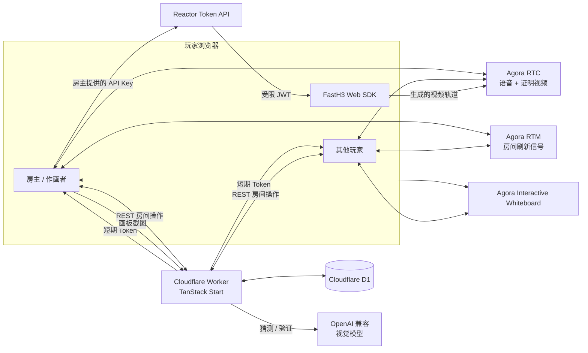

<div align="center">


# Draw & Guess

**画出来，猜出来，再击败 FastH3。**

一个实时多人绘画游戏。AI 挑战者只有在猜对画作，并生成与答案匹配的视频证明后才能获胜。


[English](./README.md) · **简体中文**

[在线体验](https://drawguess.app)

</div>

---

Draw & Guess 是一个面向朋友聚会的浏览器游戏，并可选择邀请一名 AI 玩家。玩家共享同步画板、进行实时语音、轮流作画、抢猜秘密词语，同时观看 FastH3 接受同样的挑战。

FastH3 的获胜条件比人类更严格：正确猜词只是第一步。它还必须生成一段能表现答案的短视频，并由独立的视觉模型验证这段证明后，才能获得胜利。


## 架构



各运行组件的职责：

- **Cloudflare Worker：** 管理房间状态、校验操作、签发 Agora Token、创建 Whiteboard 房间、调用视觉模型，并对公共接口进行限流。
- **Cloudflare D1：** 保存房间、席位、回合、猜测、分数、AI 尝试和短期限流记录。
- **Agora RTC：** 承载可选的麦克风语音，并将 FastH3 证明视频转发给每位玩家。
- **Agora RTM：** 发送低延迟刷新和在线状态信号，同时由 D1 保存权威游戏状态。
- **Agora Interactive Whiteboard：** 同步绘画笔画、工具、撤销、清屏和每位玩家的写入权限。
- **OpenAI 兼容视觉模型：** 根据画板截图猜词，并验证从生成视频中抽取的三帧画面。
- **FastH3：** 使用房主提供的 Reactor API Key 在房主浏览器中运行。该 Key 直接发送给 Reactor，不会经过本应用的 Worker。

完整生命周期、信任边界和降级机制请参阅 [docs/architecture.md](./docs/architecture.md)。

## 功能

- 可分享的六位房间码，以及可恢复、按浏览器标签页隔离的玩家席位。
- 房主可设置回合数、作画时间、玩家准备状态和 AI 席位。
- 轮流作画、三选一词语、倒计时、渐进提示、计分、重新开局，以及玩家离开后的房主自动转移。
- Agora Whiteboard 实时同步画笔、形状、橡皮擦、笔刷大小、颜色、撤销、清屏和快捷键。
- 可选的 Agora RTC 语音，包含明确的加入、退出和 Token 续期流程。
- FastH3 看图猜词、生成证明视频、视频帧验证，并将证明视频实时同步到整个房间。
- 空白画板保护，避免 AI 在玩家尚未作画时开始猜测。
- 支持 OpenAI Responses API 和兼容 OpenAI Chat Completions 的服务商。
- 可选的 PostHog 产品分析。
- Cloudflare Workers、D1、接口限流、安全响应头、Canonical URL、Sitemap、Robots、Open Graph 和结构化数据。

## 快速开始

### 环境要求

- Node.js 22 或更高版本
- pnpm 11
- 启用了 Workers 和 D1 的 Cloudflare 账户
- 启用了 App Certificate 的 Agora 项目
- Agora Interactive Whiteboard 凭据
- OpenAI API Key 或兼容的视觉 API
- 仅在测试 FastH3 挑战者时需要 Reactor API Key

### 1. 安装

```bash
git clone https://github.com/zicojiao/agora-drawguess.git draw-and-guess
cd draw-and-guess
pnpm install
cp .env.example .env.local
cp .dev.vars.example .dev.vars
cp wrangler.example.jsonc wrangler.jsonc
```

真实凭据应写入 `.dev.vars` 或配置为 Worker Secrets。仓库会忽略所有本地环境变量文件和 `wrangler.jsonc`。

### 2. 配置浏览器构建变量

填写 `.env.local`：

```bash
VITE_PUBLIC_SITE_URL=http://localhost:3000
VITE_DEPLOYMENT_ALIAS_HOST=

# 可选的产品分析。PostHog Project Token 是公开的浏览器标识符。
VITE_POSTHOG_PROJECT_TOKEN=
VITE_POSTHOG_HOST=https://us.i.posthog.com
```

`VITE_PUBLIC_SITE_URL` 用于生成 Canonical 元数据和生产环境重定向。部署 Fork 时，应将其设置为你自己的 HTTPS 域名。

### 3. 配置服务端凭据

填写 `.dev.vars`：

```bash
AGORA_APP_ID=
AGORA_APP_CERTIFICATE=

AGORA_WHITEBOARD_APP_IDENTIFIER=
AGORA_WHITEBOARD_ACCESS_KEY=
AGORA_WHITEBOARD_SECRET_KEY=
AGORA_WHITEBOARD_REGION=us-sv

OPENAI_API_KEY=
AI_API_BASE_URL=https://api.openai.com/v1
OPENAI_VISION_MODEL=gpt-5.4-mini
```

开发环境可使用 `AGORA_WHITEBOARD_SDK_TOKEN` 代替 Whiteboard AK/SK。生产环境应使用 AK/SK，由 Worker 创建短期、限定房间范围的只读和可写 Token。

不要给服务端密钥添加 `VITE_` 前缀；Vite 会将所有 `VITE_` 变量暴露到浏览器构建产物中。

### 4. 创建本地数据库

示例 Wrangler 配置中的虚拟 D1 ID 足以用于本地开发：

```bash
pnpm db:migrate:local
```

唯一的一份 Migration 只会创建 Draw & Guess 使用的表。

### 5. 运行

```bash
pnpm dev
```

打开 [http://localhost:3000](http://localhost:3000)。在一个浏览器标签页中创建房间，再通过另一个标签页或设备打开邀请链接。

## Agora 配置

### RTC 与 RTM

1. 创建 Agora 项目并启用 App Certificate 鉴权。
2. 将 App ID 和 App Certificate 写入 `.dev.vars`。
3. App Certificate 只能保存在服务端。Worker 会签发一小时有效的 Token；浏览器只会收到房间频道、UID 和短期 Token。

客户端会在加入频道前注册 RTC 和 RTM 事件监听器，同时续期两种 Token，并在离开前停止和关闭本地媒体轨道。

### Interactive Whiteboard

1. 为 Agora 项目启用 Interactive Whiteboard。
2. 复制 Whiteboard App Identifier、Access Key 和 Secret Key。
3. 将对应变量写入 `.dev.vars`。
4. 使用该 Whiteboard 项目配置的区域，例如 `us-sv`。

Worker 会为每个游戏房间创建一个 Whiteboard 房间，仅向当前作画者签发可写 Token，其他玩家均获得只读 Token。

## FastH3 与 AI 证明

FastH3 是可选玩家。房主点击 **Invite FastH3** 并输入 Reactor API Key，浏览器会直接向 Reactor 交换一枚有效期 15 分钟、仅允许一个 `reactor/fast-h3` Session 的受限 JWT。

在作画回合中：

1. 共享 Whiteboard 出现有效笔画后，房主浏览器才会截取画板画面。
2. Worker 请求配置的视觉模型给出一个具体猜测。
3. 猜词正确后，房主浏览器启动一段五秒的 FastH3 证明视频。
4. 浏览器通过 Agora RTC 发布生成的视频轨道，让所有玩家都能看到。
5. 三张抽样视频帧返回 Worker，进行独立的视觉验证。
6. 只有验证通过，FastH3 才能赢得本回合。

验证期间，每位玩家的浏览器都会在本地循环播放已经生成的证明视频。

为方便使用，Reactor API Key 会保存在房主的浏览器存储中。请使用权限受限的 Key；在共享设备上使用后应清除站点数据，并且永远不要提交该 Key。

## 部署到 Cloudflare Workers

创建 D1 数据库：

```bash
pnpm exec wrangler d1 create draw-and-guess-db
```

将返回的数据库 ID 写入本地 `wrangler.jsonc`，然后应用数据库结构：

```bash
pnpm db:migrate:remote
```

设置服务端 Secrets：

```bash
pnpm exec wrangler secret put AGORA_APP_CERTIFICATE
pnpm exec wrangler secret put AGORA_WHITEBOARD_ACCESS_KEY
pnpm exec wrangler secret put AGORA_WHITEBOARD_SECRET_KEY
pnpm exec wrangler secret put OPENAI_API_KEY
```

将公开的项目标识和服务商默认值写入本地 `wrangler.jsonc` 的 `vars`。只有在你拥有对应域名时，才应添加自定义域名路由。

在 `.env.production` 或 CI 环境中设置生产元数据所需的构建变量：

```bash
VITE_PUBLIC_SITE_URL=https://your-domain.example
VITE_DEPLOYMENT_ALIAS_HOST=your-worker.your-subdomain.workers.dev
```

部署：

```bash
pnpm deploy
```

## 常用命令

| 命令 | 用途 |
| --- | --- |
| `pnpm dev` | 启动本地 Worker 和 Vite 开发服务器 |
| `pnpm test` | 执行一次 Vitest 测试 |
| `pnpm test:watch` | 以监听模式运行测试 |
| `pnpm typecheck` | 执行 TypeScript 类型检查，不生成文件 |
| `pnpm build` | 构建浏览器和 Worker 产物 |
| `pnpm generate-routes` | 重新生成 TanStack 路由树 |
| `pnpm db:migrate:local` | 向本地 D1 应用 Migration |
| `pnpm db:migrate:remote` | 向配置的远程 D1 应用 Migration |
| `pnpm deploy` | 使用 Wrangler 构建并部署 |

## 许可证

[MIT](./LICENSE)
